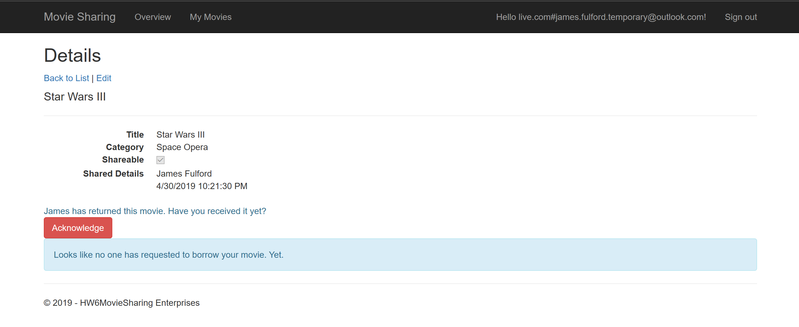
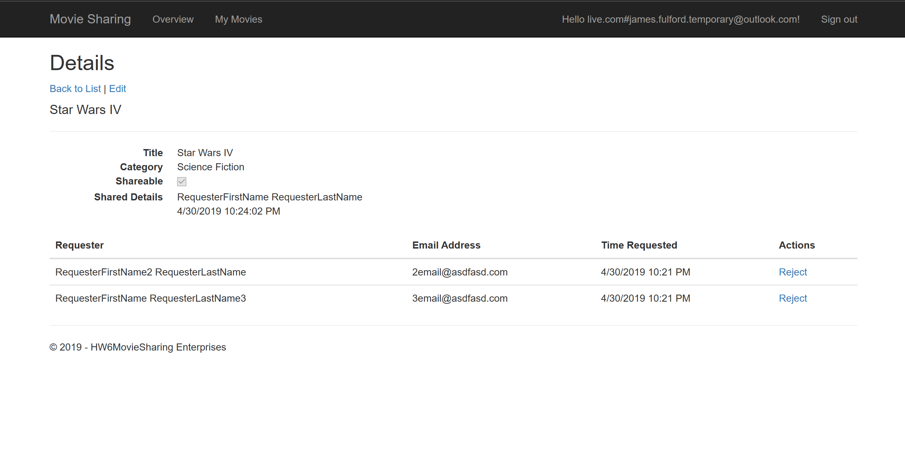

# movie-sharing-app
C# Razor Page app using Azure Active Directory and Entity Framework which allows users to borrow and lend movies to others. Deployed to Azure.

Completed as part of CSCI-E94 at Harvard University. (Assignment 6)

## Configuration
To run this API, you would have to set up a real connection string in your [appsettings.json](./HW6MovieSharing/appsettings.json) configuration to point to a SQL database. Entity Framework will interpret this connection string and will seed the database tables with some initial values, if the tables does not exist. (No need to run migrations or a separate script, for simplicty's sake)

## Flow

### Borrow and Return movies
Overview page:

Click `Return` to initate returning a movie. Also, click `Request` to request to borrow a movie.

After returning and requesting a movie, Overview page changes to prevent more return/request operations for those movies.

### My Movies
Manage your list of movies, sharing, returns, and borrowing requests.

Click on a title to manage that movie's requests and returns.

Here, you can see more details about this movie, acknowledge that the movie was successfully returned, and manage incoming requests. Let's acknowledge that this movie was successfully returned to us by clicking `Acknowledge`.

Notice how the movie is no longer shared with 'James Fulford' (next to 'Shared Details')

This is a different movie we have. It seems to be popular, since there are several requests to borrow it. Let's reject a request. Click `Reject` next to the request you want to deny, or `Accept` next to the request you want to accept.

Click `Reject` on the confirmation page to remove the request.

Click `Accept` on the confirmation page to accept a request.

Back on the `Details` page, the rejected and accepted requests have been removed from the list, and the movie is now shared with another user (look at `Shared Details`).

If you click on `Edit` from the `My Movies` or `Details` pages, you can change the details of that particular movie.

The `Shareable` field indicates whether other users can request to borrow the movie. Disabling it while shared will not reject existing requests, and it will not return the movie to you. (Think of this as a 'Listed'/'Unlisted' field)

Let's change the movie's `Category` and `Title`, and make it unshareable.

On the My Movies page, you can see several changes:
- The number of requests is now 2, instead of 4, on our movie
- The movie is now shared with someone else
- The details of the movie have been changed
- The movie is no longer public/shareable.

I just lost one of my movies (**always** oversee your kid's art projects, especially if it calls for something round...), so I'm going to remove it from my movies. Click `Delete` on either the `My Movies` or `Details` pages.

Click `Delete` on the confirmation page to delete the movie.

Now that movie is no longer tracked on the My Movies page.

Finally, if you click on `Create New`, you can start tracking a movie. I personally like 'The Hunt for the Red October' - one of the few times where the movie was just as good as the book. (And it's a good book.)

(My parents love this movie. I like it too. Maybe I'm *gasp* related to them.)

When you click `Create`, you are directed back to the `My Movies` page, where the movie is now shown.

> (I forgot to take this last picture when I took all the others, so I cut out all the information that would be inconsistent with prior images.
